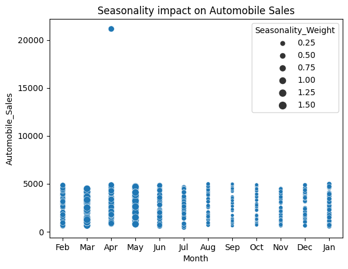

# automobile-sales-dashboard
Interactive dashboard for analyzing automobile sales trends and recession impact using Python, Pandas, Plotly, and Dash.

This project analyzes historical automobile sales data and explores how economic conditions affect automobile sales across different vehicle types.

## Key Insights
- Sales decline during recession periods
- Sports vehicles are more sensitive to economic downturns
- Unemployment rate negatively affects automobile sales
- Monthly trends show seasonality in customer demand
- Advertising expenditure differs by vehicle type and economic period

## Tech Stack
- Python
- Pandas
- Plotly
- Dash

## Features
- Interactive dashboard
- Year-based filtering
- Recession vs non-recession analysis
- Line charts, bar charts, pie charts, and scatter plots

## Project Goal
The goal of this project is to turn raw sales data into clear business insights that can support marketing, sales, and business decision-making.

## Dashboard Preview

### Sales Comparison


### Sales Trend


### Advertising Analysis


### Price vs Sales Relationship


### Seasonality


## How to Run

```bash
pip install pandas plotly dash
python app.py
